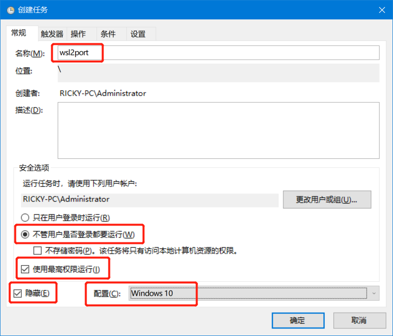
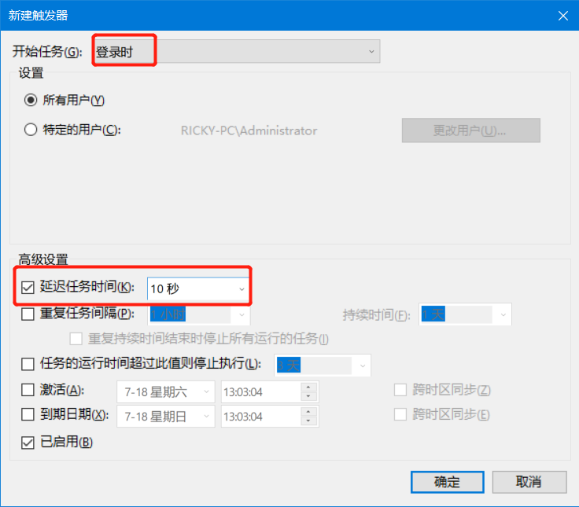
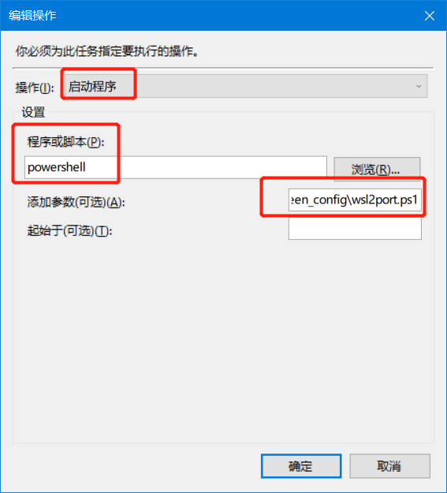
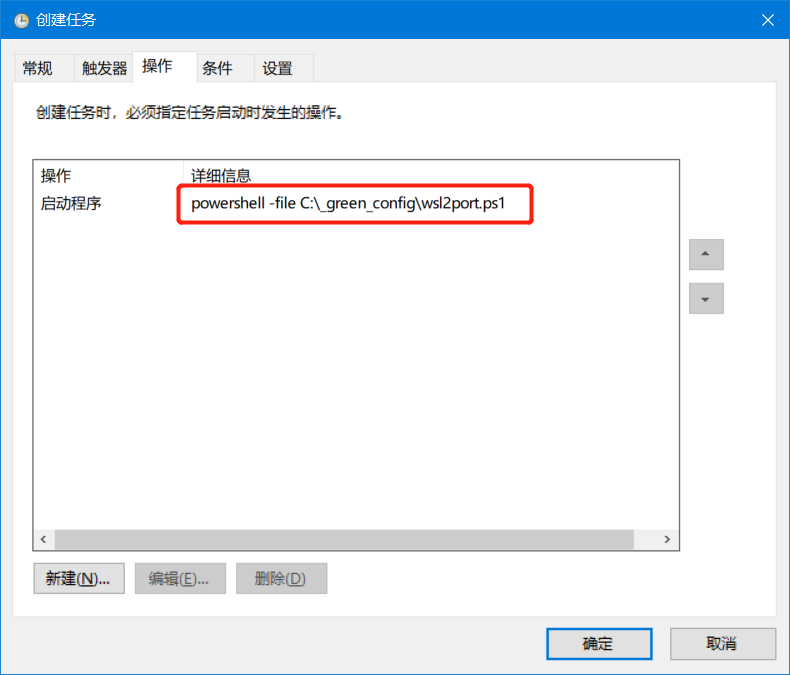
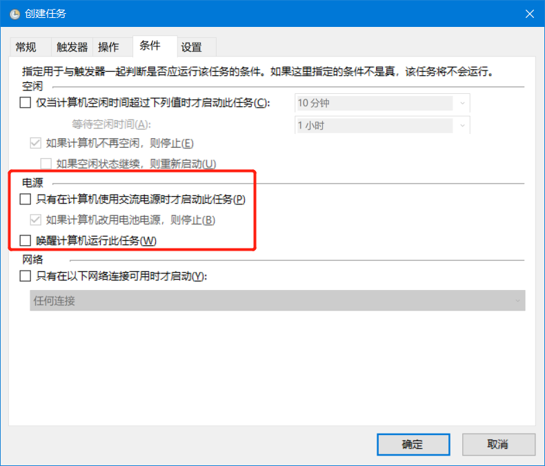
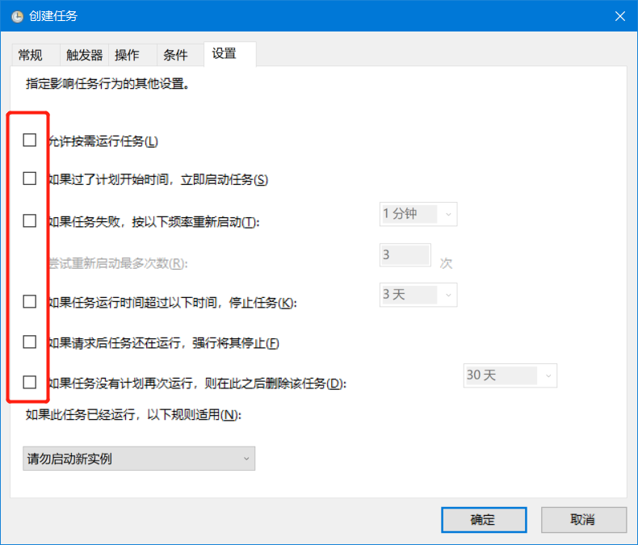

# 在WSL2中安装宝塔面板并设置开机启动, 并用127.0.0.1访问的方法

1. 管理员运行 Powershell
2. `Set-ExecutionPolicy RemoteSigned`
3. `powershell -file "//PATH/TO/wsl2port.ps1"`
4. 查看是否成功`netsh interface portproxy show all`

# 开机启动

1. 在windows下, 按Win键+R键

-> 运行`taskschd.msc`

-> 点`操作` -> `创建任务`

2. 在`常规`页面, 像下面这个搞



3. 点`触发器` -> 点`新建` -> 在`新建触发器` 页面, 像下面这么搞



 -> 确定

4. 点`操作`

-> 点`新建`

-> 在`程序或脚本`中填写
```
powershell -file "//PATH/TO/wsl2port.ps1"
```
-> 确定, 如下图



-> 再次确定后如下图



5. 点`条件`, 像下面这么搞



6. 点`设置` , 像下面这么搞



完成，重启。