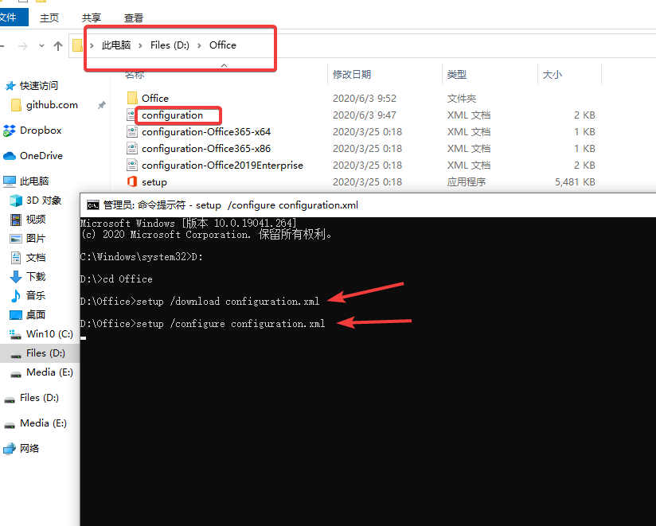

### Microsoft Office 2019 professional plus Deployment Tool

### 微软 Office 2019 专业增强版下载部署工具

- 官方部署工具：<https://www.microsoft.com/download/details.aspx?id=49117>
- 创建官方配置文件：<https://config.office.com/>

**本仓库为备份**  
本配置文件仅包含:
- Excel
- Word
- PowerPoint

使用方法:

1. [下载](https://github.com/eallion/office/archive/master.zip)或者克隆本仓库 `git clone https://github.com/eallion/office.git`
2. 如果下载的话需要解压，以解压或克隆到`D:\office`文件夹为例
3. 以管理员身份打开`CMD`
4. 运行命令
  ```
  D:
  cd office
  setup /download configuration.xml
  setup /configure configuration.xml
  ```
5. 激活。自建或寻找 KMS 服务器。参考：<https://teddysun.com/530.html>


